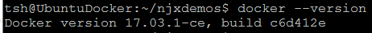

##### Thomas Schwade - January 12, 2018

## Natural Ajax performance analysis with Elasticsearch and Kibana

### What do we want to achieve?

In the follwing we see an example how to collect performance data from an Natural Ajax application, pushing that data to an Elasticsearch database and visualizing and analyzing the data with Kibana.

The example measures the elapsed time of each Ajax request on the server side, including both the processing time on the Tomcat server and on the Natural server. The collected data can be analyzed in real time with the powerful filtering and aggregation features of Kibana.

### How it works

On the Tomcat server we install a **servlet filter** that measures the execution time of each Ajax request and writes for each request a record to the Tomcat log file.

The tool **Filebeat** is running in parallel, watching the log file, filtering the relevant records and writing them to an **Elasticsearch** database.

**Kibana** is used to filter and aggregate the recorded data and helps detecting the long-running requests on the server, so that candidates for performance improvement can be identified.

In the following we set up the needed environment step by step. We use Docker containers to run the required tools.

### The servlet filter

The servlet filter is implemented in the class net.zerodrive.natural.njx.ServletFilters.LoggingFilter.java. Build the class and copy it to WEB-INF/classes/net/zerodrive/natural/njx/ServletFilters in your Natural Ajax web application on the Tomcat server.

Configure the servlet filter in the web.xml file. Make sure to adapt the parameter *pagePrefix* to your Tomcat URL with host and port. The hostname must be specified exactly in the same way as when the application is executed (with or without domain qualification).

	...
	<filter>
		<filter-name>LoggingFilter</filter-name>
		<filter-class>net.zerodrive.natural.njx.ServletFilters.LoggingFilter</filter-class>
		<init-param>
			<param-name>pagePrefix</param-name>
			<param-value>http://snowball:8480</param-value>
		</init-param>
	</filter>
	<filter-mapping>
		<filter-name>LoggingFilter</filter-name>
		<url-pattern>/servlet/Connector</url-pattern>
	</filter-mapping>
	...

Reload the web application and check the Tomcat log file. The servlet filter should write records like the following into the log file (containing session ID, Natural Ajax page, event ID and processing time in ms):

	...
	INFO Event: CASA1_690171065699151566478750487493763629752469 /NaturalAjaxDemos/njxdemos/calculator onAdd 23
	INFO Event: CASA1_690171065699151566478750487493763629752469 /NaturalAjaxDemos/njxdemos/calculator on5 13
	INFO Event: CASA1_690171065699151566478750487493763629752469 /NaturalAjaxDemos/njxdemos/calculator on2 20
	INFO Event: CASA1_690171065699151566478750487493763629752469 /NaturalAjaxDemos/njxdemos/calculator onCalc 64
	INFO Event: CASA1_690171065699151566478750487493763629752469 /NaturalAjaxDemos/njxdemos/calculator onClear 20
	INFO Event: CASA1_690171065699151566478750487493763629752469 /NaturalAjaxDemos/njxdemos/calculator on5 11
	INFO Event: CASA1_690171065699151566478750487493763629752469 /NaturalAjaxDemos/njxdemos/calculator on8 13
	INFO Event: CASA1_690171065699151566478750487493763629752469 /NaturalAjaxDemos/njxdemos/calculator onAdd 24
	INFO Event: CASA1_690171065699151566478750487493763629752469 /NaturalAjaxDemos/njxdemos/calculator on5 17
	INFO Event: CASA1_690171065699151566478750487493763629752469 /NaturalAjaxDemos/njxdemos/calculator on6 11
	INFO Event: CASA1_690171065699151566478750487493763629752469 /NaturalAjaxDemos/njxdemos/calculator onCalc 11
	INFO Event: CASA1_690171065699151566478750487493763629752469 /NaturalAjaxDemos/njxdemos/calculator endProcess 132
	INFO Event: CASA1_690171065699151566478750487493763629752469 /NaturalAjaxDemos/njxdemos/0-menu _init_ 309
	INFO Event: CASA1_690171065699151566478750487493763629752469 /NaturalAjaxDemos/njxdemos/0-menu ct.items[8].select 268
	INFO Event: CASA1_690171065699151566478750487493763629752469 /NaturalAjaxDemos/njxdemos/ctrlclienttree _init_ 61
	INFO Event: CASA1_690171065699151566478750487493763629752469 /NaturalAjaxDemos/njxdemos/ctrlclienttree ct.items[5].select 53
	INFO Event: CASA1_690171065699151566478750487493763629752469 /NaturalAjaxDemos/njxdemos/ctrlclienttree ct.items[6].select 55
	INFO Event: CASA1_690171065699151566478750487493763629752469 /NaturalAjaxDemos/njxdemos/ctrlclienttree ct.items[1].select 38
	INFO Event: CASA1_690171065699151566478750487493763629752469 /NaturalAjaxDemos/njxdemos/ctrlclienttree ct.items[7].select 45
	INFO Event: CASA1_690171065699151566478750487493763629752469 /NaturalAjaxDemos/njxdemos/ctrlclienttree ct.items[9].select 25
	...

### Elasticsearch and Kibana

The quickest way to get Elasticsearch and Kibana running is in a Docker container, using the available Docker images.

First of all we need a machine where Docker is installed. For this example I used an Oracle VirtualBox VM, running Ubuntu 16.04. On this VM I installed Docker as described in [https://docs.docker.com/engine/installation/linux/docker-ce/ubuntu/](https://docs.docker.com/engine/installation/linux/docker-ce/ubuntu/ "https://docs.docker.com/engine/installation/linux/docker-ce/ubuntu/")

We check if Docker is correctly installed:

We decide to run both the Elasticsearch container and the Kibana container in an isolated network, so that the Kibana container can access the Elasticsearch container. First we create the network:

	sudo docker network create --driver bridge elastic_kibana

and check if it was created:

	sudo docker network inspect elastic_kibana

Then we run the Elasticsearch container and make the default port 9200 available from outside the container:

	sudo docker run -d --name elastic --network elastic_kibana -p 9200:9200 -e "discovery.type=single-node" docker.elastic.co/elasticsearch/elasticsearch-oss:6.0.0

We have assigned the name *elastic* to the container so that we can later easily stop and restart it with

	sudo docker stop elastic
	sudo docker start elastic

Now we run the Kibana container in the same network and make the default port 5601 available from outside the container:

	sudo docker run -d --name kibana --network elastic_kibana -p 5601:5601 --volume ~/elastic_kibana/kibana.yml:/usr/share/kibana/config/kibana.yml docker.elastic.co/kibana/kibana-oss:6.0.0

Later we can stop and restart it with

	sudo docker stop kibana
	sudo docker start kibana

Note that we pass a custom configuration file to the Kibana container in which we refer to the Elasticsearch container:

	Contents of kibana.yml:

	server.name: kibana
	server.host: "0"
	elasticsearch.url: http://elastic:9200

Now we can check if both Elasticsearch and Kibana are running by accessing them through the Docker host machine:

	http://UbuntuDocker:9200
	http://UbuntuDocker:5601

### Pushing the log data forward to Elasticsearch

To this end we use the component Filebeat, which is also available as Docker image. Filebeat is designed to watch changes in log files and to forward new log lines to other tools for further processing, in our case to Elasticsearch.

We need some preparation in Elasticsearch, so that our log lines are correctly analyzed and stored as documents.

First we need to import the Filebeat index template into Elasticsearch:
 
	sudo docker run -it --network elastic_kibana docker.elastic.co/beats/filebeat:6.0.0 setup --template -E output.logstash.enabled=false -E 'output.elasticsearch.hosts=["elastic:9200"]'

The index template of Filebeat considers each log line as one data element. But we want to parse each log line into individual data elements before it is stored, so that we can later analyze them in detail with Kibana.

This is done with a pipeline definition in Elasticsearch. Our pipeline definition is contained in *njx-pipeline.json*. The pipeline parses the log message into separate data elements and performs some small conversions underway. For instance it removes all indexes from event names, replacing for instance 

	ct.items[6].select

by

	ct.items.select

Now we load the pipeline definition into Elasticsearch:

	curl -H 'Content-Type: application/json' -XPUT 'http://UbuntuDocker:9200/_ingest/pipeline/njx-pipeline' -d@njx-pipeline.json

Next we can start Filebeat:

	sudo docker run -d --volume ~/elastic_kibana/filebeat.yml:/usr/share/filebeat/filebeat.yml --volume ~/njxdemos/logs:/usr/share/filebeat/fblogs docker.elastic.co/beats/filebeat:6.0.0

Some remarks to the parameters:

With the following parameter we map the local filebeat configuration file into the filebeat container. An example configuration file is provided. 

	--volume ~/elastic_kibana/filebeat.yml:/usr/share/filebeat/filebeat.yml

With the following parameter we map the Tomcat log directory to the directory we have configured Filebeat to watch for. Adapt it to your specific environment.

	--volume ~/njxdemos/logs:/usr/share/filebeat/fblogs

If everything is correctly configured, each of our log events should now be pushed to Elasticsearch.

### Discovering the log events in Kibana

Filebeat creates a new index in Elasticsearch for each day and writes the log events into the coresponding index.

After we have run some events in our Natural Ajax application, we can check if the index was successfully created. We load the URL

	http://ubuntudocker:9200/_cat/indices?v 

(adapt to your Elasticsearch host and port) and should receive something like

	health status index                     uuid                   pri rep docs.count docs.deleted store.size pri.store.size
	yellow open   filebeat-6.0.0-2018.01.11 76BXxwX1QdiBYkCG6QpsaQ   5   1         86            0    204.5kb        204.5kb

Then we load the Kibana URL and make the new index known to Kibana:

	http://ubuntudocker:5601

First we create the index pattern in Kibana:

We need to refresh the field list once, to make also the fields known to the index pattern that were created by the pipeline:

Then we can use Discover to list the events logged so far, and we can select the fields we want to see.

### Visualizing the log events in Kibana

We create a first simple visualization in Kibana that aggregates the logged data and gives a first overview of the distribution of the processing times. As an example we study the distribution of the processing time across the various events in the application.

Create a new visualization:

Select Pie chart:

Select the index that contains our data:

Separate the data into buckets (example):

Display the Pie chart:

In our example we see that the majority of events lasts below 100 ms, only a few events last more than 500 ms. We switch over to Discover and apply a corresponding filter to identify these long running events:

This is just a small example. kibana offers many more options to aggregate and visualize data. In particular, several visualizations can be combind to a dashboard, which is refreshed on aregular basis and allows monitoring our log data in real time.

 

